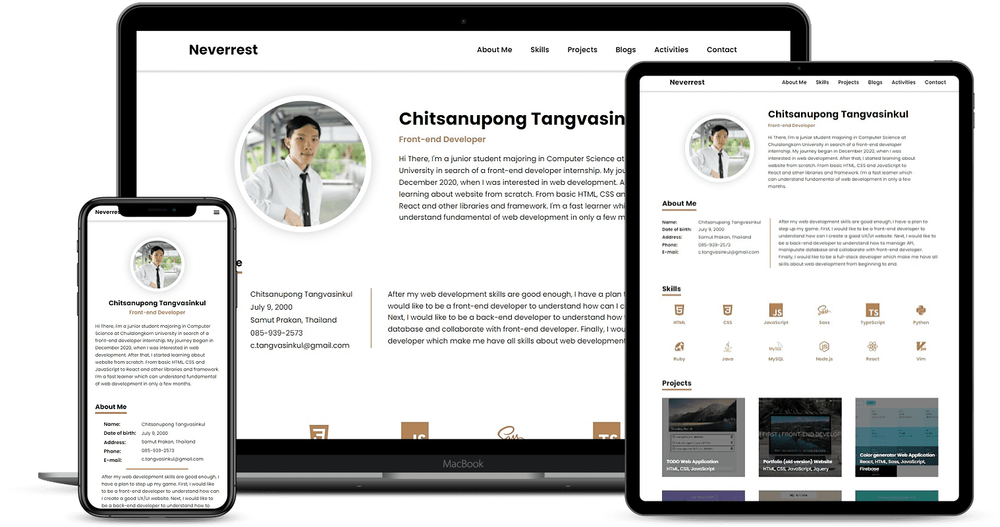

# Portfolio New Version

After I had finished my old portfolio with HTML, CSS, JavaScript and not using framework or React, I have learned new framework and library. So, I have new idea to create new portfolio website with my new knowledge. Then, I found static site generator like Gatsby that very appropriate to do static portfolio website which not connect to the database. So, the advantage of Gatsby is improving your website performance and loading time with a ton of plugins that you can use. This advantage is absolutely fit to what I want to do like portfolio website. The result is my brand new portfolio website is loading very fast and get at least 90 score in PageSpeed Insight.

### Technologies

### React
- useState
- useEffect (fetch API)
- conditional rendering (loading page, handle error)
- async/await

### Dependency
- xml2json-light - extract data inside xml tag to plain text (nocodeAPI and medium API)
- gatsby
- gatsby-source-filesystem - navigate gatsby to know where is the file
- gatsby-transformer-remark - enable receive data from markdown file 
- gatsby-plugin-sass - use Scss in gatsby project
- sass - use Scss in gatsby project
- gatsby-plugin-google-fonts - use google fonts by cdn
- gatsby-plugin-image - use static image to optimize image and do traced placeholder
- gatsby-plugin-sharp - works together with gatsby-plugin-image
- gatsby-transformer-sharp - - works together with gatsby-plugin-image

### Description
- 

### Reference
- How to fixed headers and sections anchor when using navigation bar to scroll down to a section: https://www.caktusgroup.com/blog/2017/10/23/css-tip-fixed-headers-and-section-anchors/ 
-  
